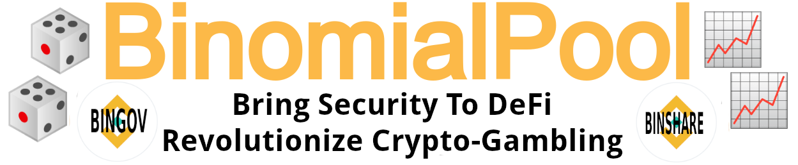

  

[binomialpool.finance](https://binomialpool.finance/) is an _unruggable liquidity pool_, running on Binance Smart Chain.
_Unruggable_ means that the system remains secure even if the core developers were corrupted.
Therefore, BinomialPool is built for yield farmers who are sick of the frauds in the current DeFi-ecosystem.

BinomialPool provides the following services:

- 🎲 For gamers: Place provably fair bets with a 0.8% house edge.
- 📈 For yield farmers: Earn the house edge with a much lower risk than typical DeFi-investments.
- 📈🎲 Both yield farmers and gamers participate in the BINGOV-airdrop.
- 📈 Additionally, yield farmers earn a 0.5% withdrawal-fee if other yield farmers are withdrawing their deposits.

Unlike many other dapps, you can use BinomialPool directly from your wallet without any website.

## ⭐⭐ Early Adopter Bonus ⭐⭐

To incentive early adopters, users of BinomialPool receive _BINGOV_ via an automated airdrop.
BINGOV is the governance token of BinomialPool.

- 📈 Yield farmers receive BINGOV for every deposit.
- 🎲 Gamers receive BINGOV for every bet, regardless of whether they win or lose.

The BINGOV-airdrop uses _halvings_ that are similar to Bitcoin-halvings.
The halvings limit the total supply of BINGOV, such that BINGOV is a deflationary token.
The halvings work as follows:

- Before the first halving: 1 BINGOV for each BNB deposited or betted.
- After the first halving: 0.5 BINGOV for each BNB deposited or betted.
- After the second halving: 0.25 BINGOV for each BNB deposited or betted.  
And so on and so forth...

The first halving happens after 500 BNB, the second after 1000 BNB, the third after 2000 BNB and so on.
Visit [binomialpool.finance](https://binomialpool.finance/) to see when the next halving is happening!

Once BINGOV is sufficiently decentralized, the governance will be transferred to a decentralized autonomous organization (DAO).
To benefit BINGOV-holders, the DAO can charge anywhere between 0% and 1% betting-taxes.
_However, until the DAO is established, betting-taxes remain at 0%._

_________________________

The remainder includes the following sections:

- 🎲 [BinomialPool For Gamers](#-binomialpool-for-gamers-)
- 📈 [BinomialPool For Yield Farmers](#-binomialpool-for-yield-farmers-)
- 🏦 [BINGOV - BinomialPool's Governance](#-bingov---binomialpool-governance-)
- 🔒 [Security Analysis](#-security-analysis-)

_________________________

## 🎲🎲 BinomialPool For Gamers 🎲🎲

BinomialPool is different from traditional gaming-sites because you can place bets directly from your wallet _without any website in between_.
Wins are paid in the very same moment that you are betting.
BinomialPool charges a cheap 0.8% house edge.

### 🎲 How can I bet? 🎲

To make bets, send BNB to the address [0x5ffaeb3a1abde2344f51bd193591698c61e95e65](https://bscscan.com/address/0x5ffaeb3a1abde2344f51bd193591698c61e95e65).
To be safe, set a gas limit of 200k or higher.
Your win-probability depends on the _last digit_ of your wager.
See the following examples:

| Wager | Win-probability |
| ------------- | ------------- |
| 0.001 BNB | 10% |
| 0.2 BNB | 20% |
| 10.3 BNB | 30% |
| 0.4 BNB | 40% |
| 0.045 BNB | 50% |

Afterwards, you can see your wins or losses in https://bscscan.com/address/0x5ffaeb3a1abde2344f51bd193591698c61e95e65#events.

> :warning: Beware of scams! Never send BNB to an unverified address! The legitimate address of BinomialPool is 0x5ffaeb3a1abde2344f51bd193591698c61e95e65.

### 🎲 How much can I bet? 🎲

For a single bet, the maximum win-value is (1/4000) of the total value locked.
Visit [binomialpool.finance](https://binomialpool.finance/) to see the total value locked.

_________________________

## 📈📈 BinomialPool For Yield Farmers 📈📈

By providing BNB, yield farmers earn the house edge that is paid by gamers.
Unlike many other DeFi-projects, 100% of the rewards go to yield farmers.

### 📈 Why BinomialPool? 📈

Many DeFi-projects are susceptible to hacker-attacks or frauds.
In contrast, BinomialPool is not only secure against external hackers, but is also secure against the core-developers.
This security is achieved via the following principles:

- **Simplicity**: BinomialPool uses very little code and is easy to audit.
- **Self-contained**: BinomialPool does not use any external contracts that might be targeted by hackers.
- **No updates**: BinomialPool's code cannot be changed.

### 📈 How high is the yield? 📈

BinomialPool's yield depends on the gaming-activity after your deposit.
More specifically, BinomialPool provides a _mathematically guaranteed yield_ within a probability of 99.7%.
The following table shows yields until half a million bets after your deposit.

| Number of bets  | Expected yield | Min/max-yield within 99.7% |
| ------------- | ------------- | -------- |
| 0 bets | 0.00% | Min: 0.00% Max: 0.00% |
| 50000 bets | 5.18% | Min: -3.87% Max: 14.22% |
| 100000 bets | 10.71% | Min: -2.60% Max: 24.02% |
| 150000 bets | 16.56% | Min: -0.75% Max: 33.88% |
| 200000 bets | 22.51% | Min: 1.42% Max: 43.61% |
| 250000 bets | 28.88% | Min: 4.62% Max: 53.13% |
| 300000 bets | 35.76% | Min: 8.29% Max: 63.23% |
| 350000 bets | 42.92% | Min: 11.58% Max: 74.25% |
| 400000 bets | 50.18% | Min: 15.00% Max: 85.37% |
| 450000 bets | 57.79% | Min: 18.37% Max: 97.21% |
| 500000 bets | 65.84% | Min: 22.70% Max: 108.99% |

Although the minimum yield can become negative in the early phase, it is certain to become positive after 200k bets.

> Sidenote: The yields above are computed with the maximum win-value of (1/4000) of the total value locked.
> If gamers are betting smaller values, then it will take more bets before the yields are reached.

### 📈 Who is behind BinomialPool? 📈

BinomialPool is not a company, but an open-source DeFi-protocol that is owned by its yield farmers.
BinomialPool is programmed in a way to make exit-scams impossible.
Nevertheless, BinomialPool has publicly known developers to increase the level of trust.

### 📈 Let's get started - How can I yield-farm? 📈

To start yield-farming, send BNB to the address [0x5ffaeb3a1abde2344f51bd193591698c61e95e65](https://bscscan.com/address/0x5ffaeb3a1abde2344f51bd193591698c61e95e65).
**To make this work, the last digit of your deposit-amount needs to be "9".
For example, you can deposit amounts like 0.59 BNB or 100.0009 BNB, but you cannot deposit amounts like 0.5 BNB.**
Set a gas limit of 200k or higher.

You receive BINSHARE in return for your deposits.
Visit [binomialpool.finance](https://binomialpool.finance/) to see the current value of BINSHARE.
Finally, make the following tokens visible in your wallet, by adding the addresses as "custom tokens":

| Token | Address | Network |
| ------------- | ------------- | ------------- |
| BINSHARE | [0x5ffaeb3a1abde2344f51bd193591698c61e95e65](https://bscscan.com/token/0x5ffaeb3a1abde2344f51bd193591698c61e95e65)| Binance Smart Chain Mainnet |
| BINGOV | [0xa26fdf2d8988533dd829fe4f4d5045e40408f9f0](https://bscscan.com/token/0xa26fdf2d8988533dd829fe4f4d5045e40408f9f0)| Binance Smart Chain Mainnet |

To withdraw your BNB, simply transfer your BINSHARE to the address [0x5ffaeb3a1abde2344f51bd193591698c61e95e65](https://bscscan.com/address/0x5ffaeb3a1abde2344f51bd193591698c61e95e65).
You will be charged a 0.5% withdrawal-fee, but you will earn withdrawal-fees from other yield farmers who are withdrawing earlier than you.

_________________________

## 🏦🏦 BINGOV - BinomialPool Governance 🏦🏦

BINGOV is based on the principle of _weak governance_.
Unlike many other DeFi-projects, BINGOV does not have the ability to swap code or mint tokens.
BINGOV is limited to the following abilities:

- Change the house edge between 0.1% and 2% (currently 0.8%).
- Charge win-taxes between 0% and 1% (currently 0%).
- Change the maximum win-value between 1/1000 and 1/10000 of the total value locked (currently 1/4000).

All of those decisions will be made by a DAO once BINGOV is sufficiently decentralized.
_________________________

## 🔒🔒 Security Analysis 🔒🔒

This section is only for technically advanced readers.
For the security of BinomialPool, we consider two key questions:

- **Statistical soundness**: Are the expected yields correct?
- **Contract manipulations**: Is it possible to exploit the contract?

### 🔒 Statistical Soundness 🔒

The listed yields have been computed via Monte-Carlo-Simulations.
Statistically inclined readers can verify yields by checking the code in [js-simulate](js-simulate).

### 🔒 Smart Contract Manipulations 🔒

The production of blocks is a potential security-concern.
For example, malicious block-producers might conduct the following attacks:

- Manipulate randomness until a bet is winning for them.
- Selectively dismiss bets that are losing for them.

We believe that such attacks are unlikely on Binance Smart Chain.
If Binance's block-producers were conducting an attack like this, then this could severely damage the reputation of Binance.
Nevertheless, BinomialPool enforces a _stop-loss_ of 10% to protect yield farmers.
This means that if BINSHARE ever drops 10% from its all-time-high, then the contract accepts no more bets and yield farmers have unlimited time to withdraw their BNB.  
